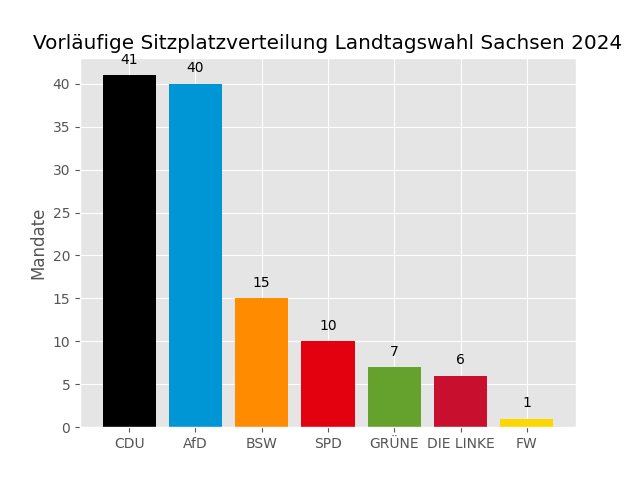

# Sachsen Mandatsberechnung Landtagswahl 2024

Dieses Repository enthält den Code zur Berechnung der Sitzverteilung bei der Landtagswahl in Sachsen. Es implementiert den Algorithmus zur Verteilung der Mandate auf Grundlage des [Sächsischen Wahlgesetzes](https://www.revosax.sachsen.de/vorschrift/20176-Saechsisches-Wahlgesetz#x1), insbesondere nach den Bestimmungen von §6 des Gesetzes.

## Inhalt

- `preprocess.py`: Dieses Skript bereinigt und verarbeitet die Rohdaten des Wahlleiters, um sie für die Sitzberechnung nutzbar zu machen.
- `main.py`: Berechnet die Sitzverteilung gemäß dem Sainte-Laguë-Verfahren und den Sonderregeln für Überhang- und Ausgleichsmandate.
- `plot.py`: Erstellt einen einfachen Plot zur Visualisierung der berechneten Sitzverteilung.

## Ergebnis 

## Abhängigkeiten

Das Projekt erfordert folgende Python-Bibliotheken:
- `pandas`
- `matplotlib`

Installiere die Abhängigkeiten mit:

`pip install pandas matplotlib`

## Lizenz

Dieses Projekt steht unter der [MIT Lizenz](LICENSE).

## Kontakt

Ersteller: Georg Lange

E-Mail: mail@georglange.com
